# Visual Capes Add-on: Extension Pack

Using the extension pack of the add-on utilizes complex scripting features to make cape equipping much easier.

Choosing a cape with the Cape Menu is implemented here. In order to open the menu, get yourself a Pumpkin Pie and rename it to the anvil as **Cape Selector**. After renaming, you can now start choosing your capes by right-clicking the pie!

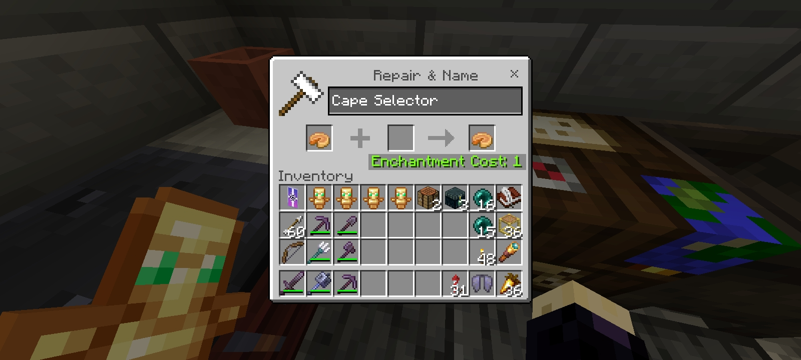
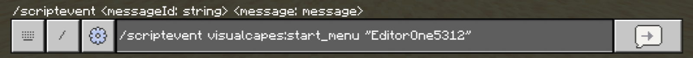
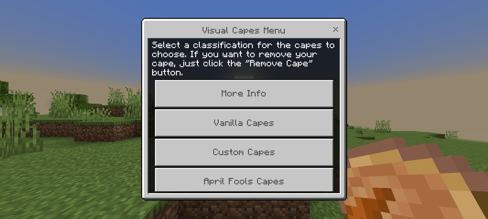
 

Another way of opening the Cape Menu is to use the custom `/cape` command. `/vca:cape` is used when the same custom command name is used by other script packs.

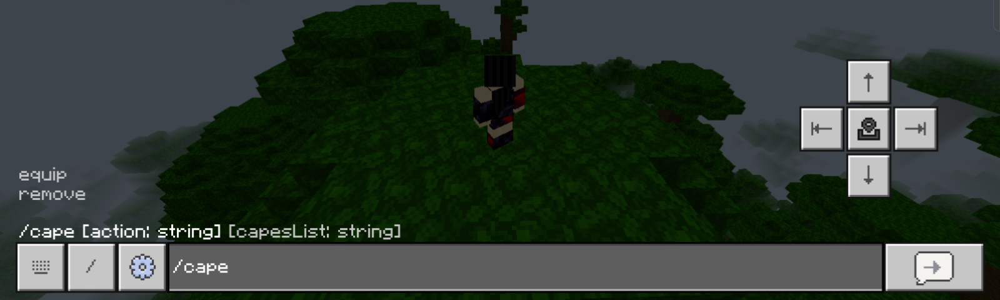
 

## Pack Settings

This pack extension has its own settings to select which mode you want to implement within the world, whether you prefer the default or the new Rarity System.

 

# Rarity System Feature

An add-on's system feature where cape rarities are implemented as true rarity within the world where capes requires "privilege" to be equip. Capes having real rarity can be a game achievement you can share with other players.

Rarity System by default only reduces players' access to capes where operators/admins has the ability to grant or revoke you a cape or a rarity.

To gain access to the **Operator's Cape Menu**, use this custom command provided below. Both add and remove operators are available.

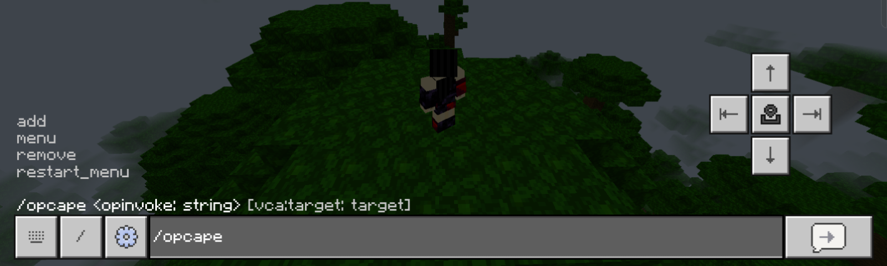
 

* Restarting a menu also included with this command.
* The "Cape Selector" Pumpkin Pie utilizes the operator's menu when granted permission.
* The `/opcape menu` command will override `/cape` when Operator's Cape Menu is accessible.

This is how the operator's menu looks; the two methods you can see are already labeled inside the menu.

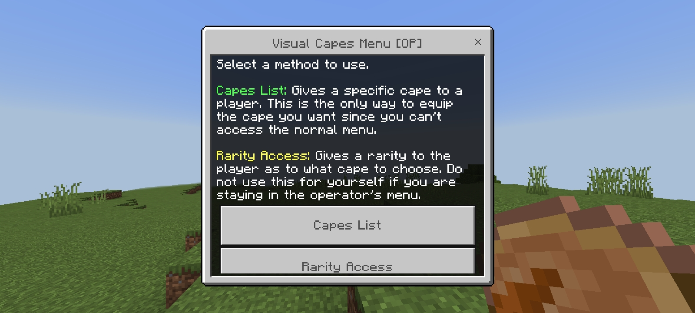
 

Operators of Cape Menu can deliver any player with any cape or raraity privilege. This what should look like when you received a cape from an operator:

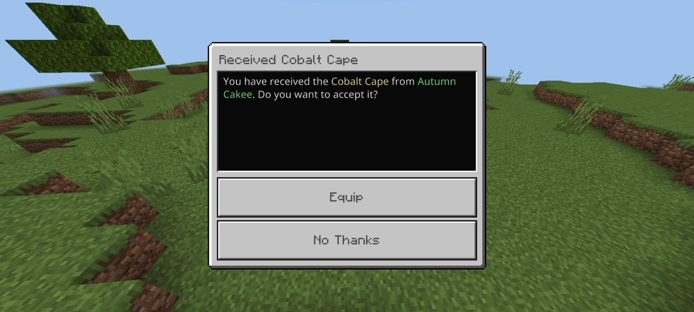
 

## Rarity System with Survival Tweaks

This mode is designed specifically for survival worlds because of the **Cape Reward** feature. It lets you grant tiered potency effects "buffs" with infinite duration, or lets you activate unique buffs. These buffs allows players to be stronger than before, where they can no longer fear such dangerous situations or combats.

To get a buff and essetially grant privilege to equip higher rarity capes. Rename any item as **Reward Convert** and right-clicking to the item opens the menu.

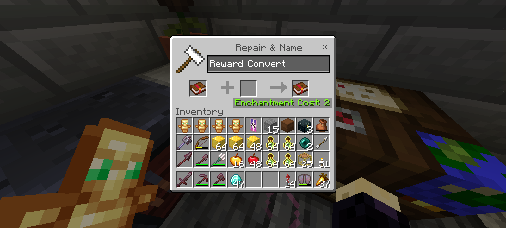
 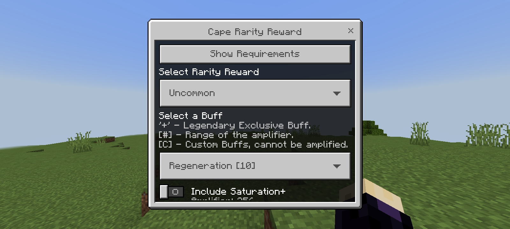
 

Another way of accessing the menu is to use the custom `/caperegister` command. `/vca:caperegister` for alternative command.

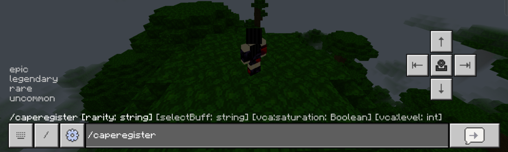
 

* Required items to register should be in player's inventory.
* Buffs only activate when the equipped cape has the same rarity as the registered buffs.
* Buffs only decays when player dies.
* Custom Buffs are activated using Heavy Core in inventory.
* Registered buffs are displayed to Cape Menu, buffs' rarity are also shown.

This is an example of capes list from Vanilla Cape Menu when granted an Epic rarity privilege:

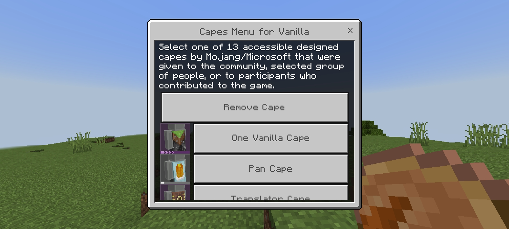
 

> [!TIP]
> How do I get Experience Bottles?
>
> There are only two ways to get those bottles. The easiest way is to trade with a Cleric Villager up to Master profession. On the other hand, loot the bottles in Stronghold chests.
>
> 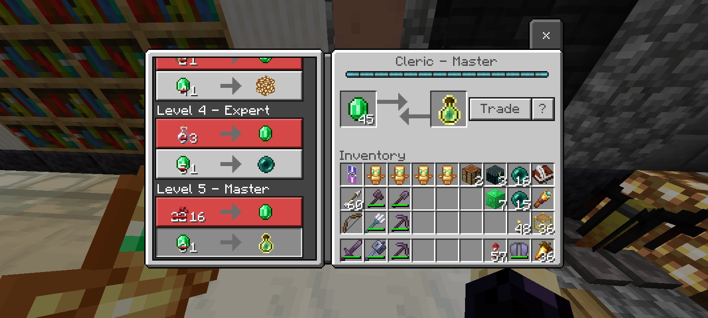

### Item Tweaks

Enchanted Golden Apple can now be crafted, but you actually need to have at least 2 of them to duplicate 1. The recipe is shown below.

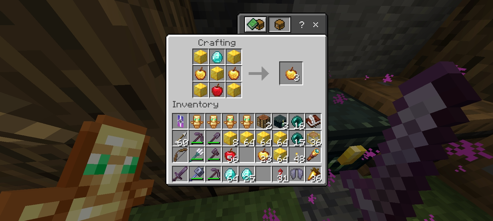
 

Heavy Core can now be obtained in a different way! This is only possible when a player has a buff with an amplifier higher than 7. If they die from an explosion, they will drop a Heavy Core, even if they do not have one in their inventory.

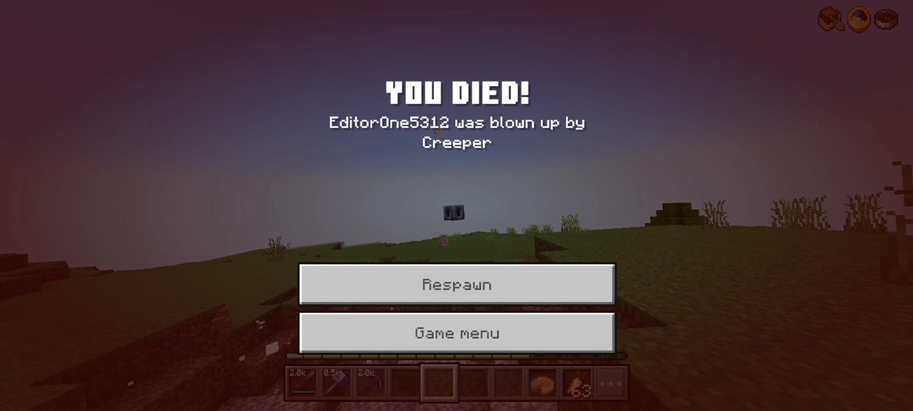
 

### Custom Buffs

Custom Buffs (or Unique Buffs) are the buffs that requires a **Heavy Core** in your inventory to activate. Most of these buffs cannot be amplified because they are fixed. There are currently 5 Custom Buffs available, their descriptions can be read to the Cape Menu.

* Curse of Binding
* Instant Recover
* Nether Domain
* Self Destruct
* Wind Pulse

