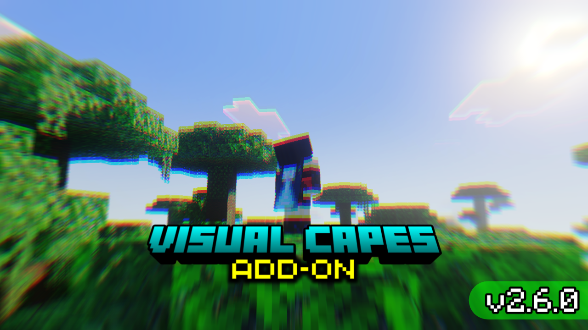
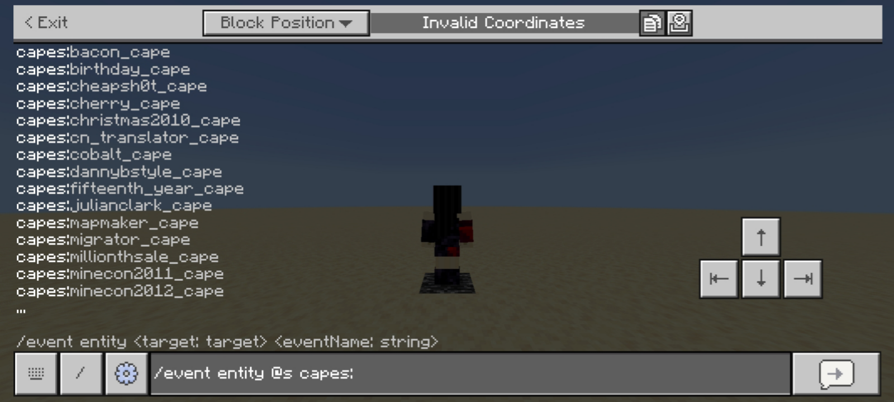
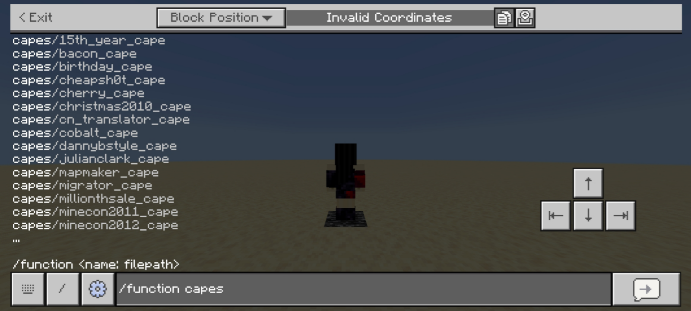
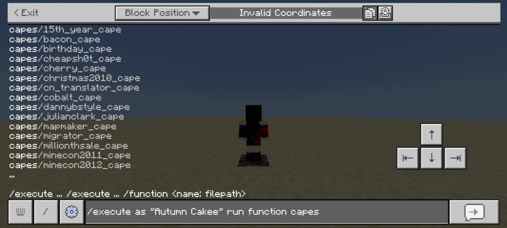
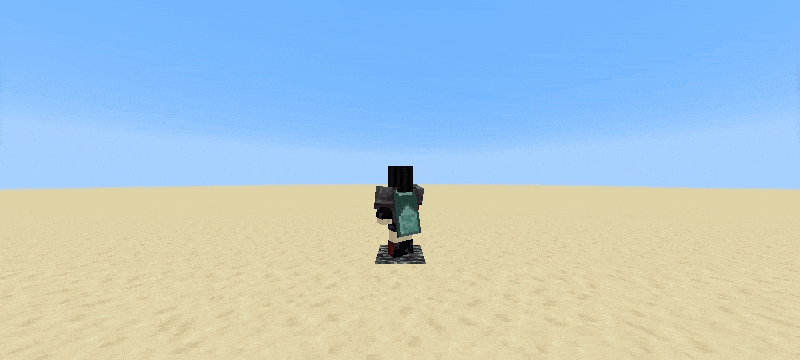
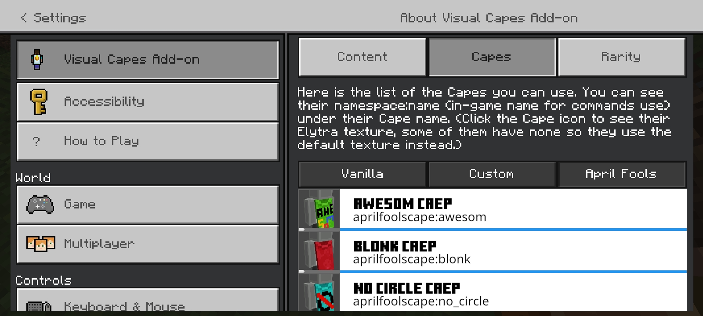
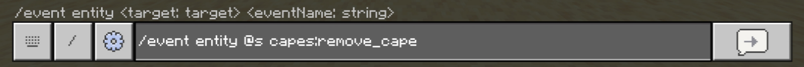
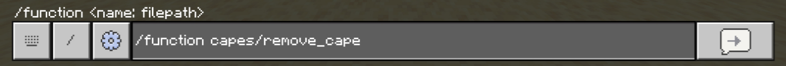
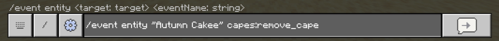
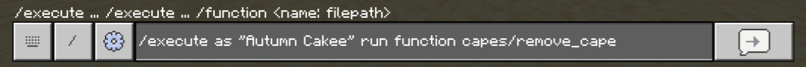

# Visual Capes Add-on

Are you frustrated using a cape resource pack where others cannot see it, or do you want an add-on where each player can have different capes equipped in your world? Therefore, this add-on is for you! You can set what capes you, or they want to equip!

---

## Features

### Equipping Cape

You can choose what cape you want to equip with commands. If you have access to commands, then you can equip or change your cape. You can use either the `/event` or `/function` commands.

 

To apply a cape to another player, both `/event` and `/execute ... function` work fine:

* `/event entity <target>`
* `/execute as <target> run function`

 

### Capes with Elytra

Equipping one of the capes will change its elytra texture too! (Each cape has its own different elytra texture, some have none, see Capes Tab in-game as shown below.)

 

### Removing Cape

To remove your cape, one of these specific `/event` or `/execute ... function` commands can be used:

 

To remove another player's cape, use one of these specific commands:

* `/event entity <target> capes:remove_cape`
* `/execute as <target> run function capes/remove_cape`

 

### More Features

* **Custom Cape Template**

To add your designed or downloaded capes to this add-on, along with its rarity icon for **Rarity System**. There are currently 20 templates available. Cape template textures and icons are located to:

`bundle/VisualCapesRP/textures/capes/+custom/custom/`

Template files are given with the resource pack:

`bundle/VisualCapesRP/textures/capes/+custom/_templates/`

You can watch [this video](https://youtu.be/ePSeJt415I0?si=Osm1GnEqp5g0ST6R&t=340) on how to make your own custom cape design and import to this add-on (also, subscribe if you enjoyed this add-on).

*Rarity System Only*: You can edit the Custom Template Capes' properties in the Pack Extension:

`bundle/VisualCapesExt/scripts/custom_capes.js`

---

* [Extension Pack / Rarity System](EXTENSION_PACK.md).
* [Changelog](CHANGELOG.md).

## Credits

Credits to Minecraft Wiki for Cape and Elytra textures:

* [Minecraft Wiki: Cape](https://minecraft.wiki/w/Cape)
* [Minecraft Fandom Wiki: Cape](https://minecraft.fandom.com/wiki/Cape)

## Notes

> [!IMPORTANT]
> Removed Version Selector because the add-on was not maintained for a long time. Updates are only made when a Drop is released or new capes are added, add-on updates might take longer to be released after such an update.

* If you are using the "Character" skin type, it will turn to the default skin, such as Steve, Alex, etc. This is a Minecraft bug. It may get fixed in future updates.
* If you are planning to use this in your survival singleplayer world, I do not recommend importing this addon to your world; you are going to lose the ability to obtain achievements. Feel free to use others' custom capes resource packs.
* This add-on does not support packs that use Player JSON files, utility packs, cosmetics packs, or packs that modify Cape and Elytra rendering.

## Installation

To download and import this add-on to your world, navigate to **Releases** and select an add-on version.

* Download the `.mcaddon` file.
* After downloading the file, navigate where the file is stored.
* Click the file then select **Open with Minecraft** (Method may vary).
* If the add-on is imported successfully, activate the add-on to your world and enjoy!

> [!NOTE]
> Minecraft packs use [Universally Unique Identifier (UUID)](https://en.wikipedia.org/wiki/Universally_unique_identifier) to identify every pack stored locally in Minecraft. When the add-on failed to import because of "Duplicate pack detected" even when no match is found, it is most likely caused by a matching UUID with the other packs.

## License

Please refer to this [License](LICENSE.md).

*Disclaimer: NOT AN OFFICIAL MINECRAFT PRODUCT. NOT APPROVED BY OR ASSOCIATED WITH MOJANG OR MICROSOFT*

## Contributing

To support development of this add-on, refer to [here](CONTRIBUTING.md).

## Acknowledgment

- [Termux](https://github.com/termux/termux-app)
- [NodeJS](https://nodejs.org)
- [Mojang/Microsoft](https://www.minecraft.net)

---

Project Started on 2024, June 1st.
 
Thank You!   - EditorOne XI
